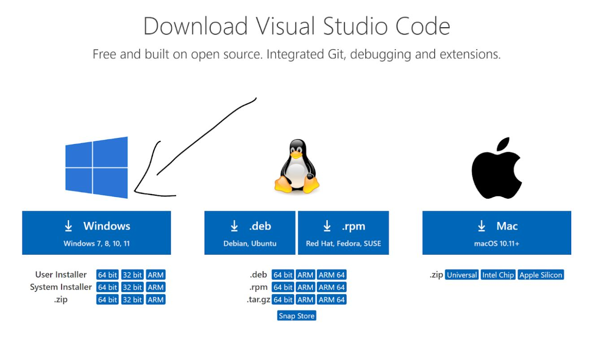

# Lab Report 1

## Installing VSCode (Visual Studio Code)
To install Visual Studio Code, firstly, I went to the [download](https://code.visualstudio.com/download) site, and downloaded for my computer, a Dell XPS, and thus one with a Windows operating system. 

Make sure to install the version that matches your computer’s operating system, i.e. mine would be the 64 bit installer.

 After downloading, I get a window that looks similar to this (I downloaded VS Code far before this activity – so this is what it looks like for me now): 
 

 ## Remotely Connecting

 The first step to remotely connecting is to have OpenSSH installed on your machine, my Windows Machine already had the OpenSSH Client present, but not the OpenSSH Server. 
So, I installed the OpenSSH server using the powershell, and running the following commands: 

Now, to remotely connect, use the following commands:

ssh [username]@ieng6.ucsd.edu
In the context of this class, that username is cs15lwi22[specific account – mine being (atb). 
Then enter in a password. Note that the password won’t show up on screen, but it is being entered!

You should get a screen like the one I got above ^. 
The screen after logging in shows the % CPU being used in the system as well as a chart with previous logins and load averages. 

## Trying out Commands

I tried multiple commands in my first time on terminal, and here is a screenshot showing some examples:

Here are what some basic commands mean:
* **cd** -> change directory
* **pwd** -> present working directory
* **ls** lists files in a directory
* when ls is succeeded by:
* **-a** it lists absent files
* **-t** lists most recent
* **-l** lists details of all files (long listing)

HELPFUL TIP: use the **man** [command] to get a sort of explanation of what the specific command is! 

## Generating SSH Keys

The first step I take when generating an SSH key is to use the **ssh-keygen** command which produces a public and private key pair.

Choose the default file in which to save the key, and press enter during the passphrase portion. 

The reason my terminal asked if I wanted to overwrite was because I attempted multiple times to do this task. If asked to overwrite, I would put yes, because there is a new public/private key being generated. 

Then I **scp** the file from the public key location to my SSH server!

After this, I log in to the **ssh** server using my UCSD login credentials, and since  there is no password due to my keygen having no passphrase, I am allowed access to the server without having to enter a password!!! 

## Optimizing Remote Running 
To optimize remote running, I can add commands to the **ssh** command in quotation marks, and it will perform that command. For my example, you can see that the **ls** comand runs and the files in the directory are listed. 

Meanwhile for the above command, I ran multiple commands on the same line which then performs all these commands after **cp**. 

[My First Github Page](https://ianchanattu2003.github.io/cse15l-lab-reports-/)
