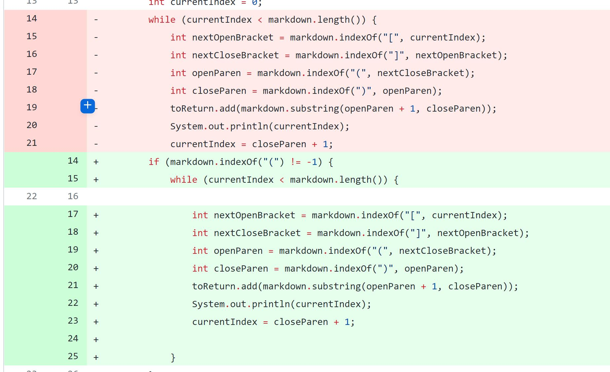
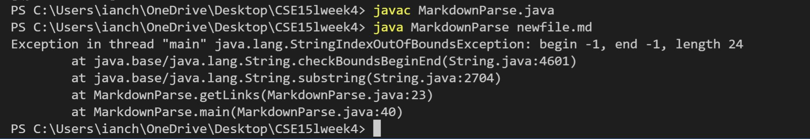
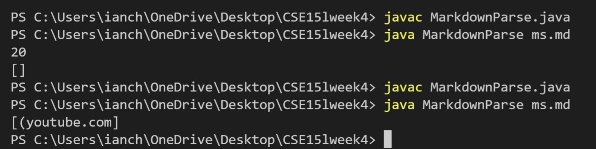
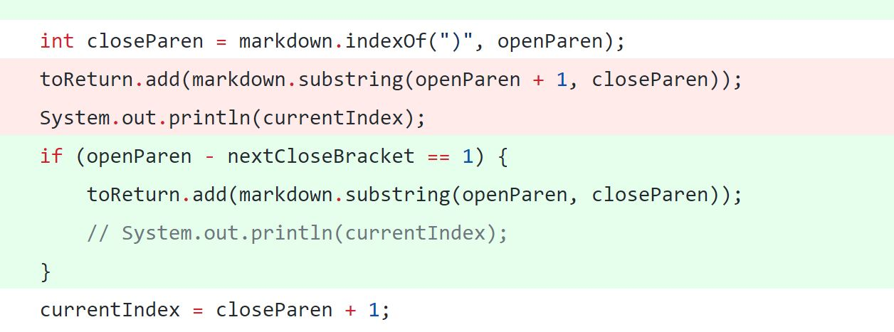

# Lab Report 2

## Code Change 1

Here is an image of the code change I made. In this case, I added an if statement to account for input that does not include a (

Here is the file which caused the failure-inducing input:

[newfile.md](newfile.md)

The following shows the wrong output or the "symptom" that is being shown.

As can be seen here, the symptom, which was the exception method thrown, indicated a bug that should fix the symptom. This fix includes asking for an if condition so that an input that does not contain a "(" should not return any output aside from an empty arraylist.
## Code Change 2 

Here was the second code change made. This was expanding the if condition to check for a second condition.

This change was made due to incorrect output from the following test file:
[ms.md](ms.md)

A symptom of this failure inducing output is as follows (when reading this file). 

As can be seen in the past three images, the symptom which is the wrongful output, is caused by the failure inducing input of a link without the link header, or [link] which is necessary for a link to be created in markdown. This symptom is fixed by adding an additional if statement to ensure that a bracket is is also present in the link notation.

## Code Change 3

Here was the third code change made. This is adding an additional if statement to ensure that the link is in the correct input format.

This bug was needed because of the error inducing input of the following file, with a large gap between the bracket of the file and the following parenthesis:
[test3.md](test3.md)

The following shows the symptom of this, or the wrongful output:

In this case, we see that an addition if statement is added to ensure that the link format is proper, due to the symptom that we saw in the wrongful output of the input of a link that contained a large gap between the bracket and parenthesis. To fix this, we added the if statement that ensures that the "(" is after the "]". 

