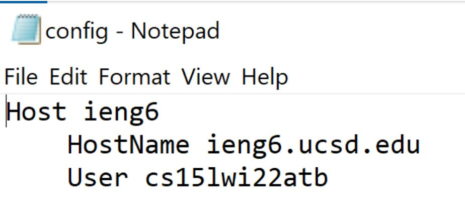
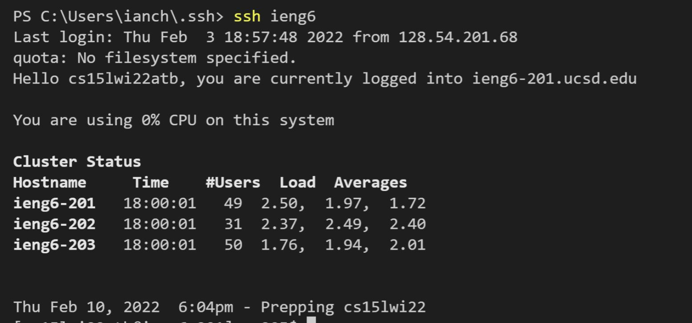
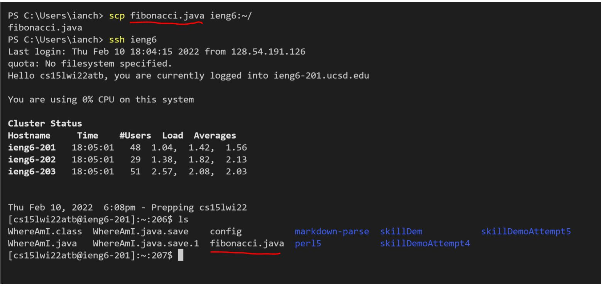

# Streamlining SSH Configuration - Lab 3

##  .ssh/config file Setup

I set this file up using Windows notepad in the directory that contains my ssh keys. This can be seen in the following image. I made sure to add my course specific account when setting up this process to ensure it worked:

## Logging in using SSH

As can be seen here, I successfully logged into the ssh server using my shortened alias.

## SCPing using my Shortened ieng6 account
As can be seen here, I successfully scped a file using my shortened alias.

